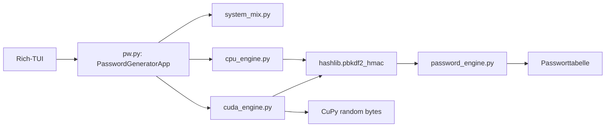

# Architektur- und Performance-Baseline

**Datum der Prüfung:** 18. August 2026  
**Projektzustand:** reine Python-CLI, vor dem geplanten Backend-/Benchmark-Refactoring

## Ausführungsumgebung

| Eigenschaft | Nachweis |
|---|---|
| Betriebssystem | Linux, x86-64, Kernel 6.18.38 |
| CPU | Virtuelle Intel-Xeon-CPU, 6 logische CPUs, AVX2/AVX-512 sichtbar |
| Python | CPython 3.12.3 |
| NVIDIA/CUDA | **Nicht verfügbar**: `nvidia-smi` fehlt, `cupy` ist nicht installiert |
| Rich-TUI | Installiert und im interaktiven Smoke-Test nutzbar |
| Zielhardware RTX 4070 SUPER | **NOT VERIFIED**: in dieser Umgebung nicht vorhanden |
| Zielhardware ARM64 | **NOT VERIFIED**: in dieser Umgebung nicht vorhanden |

## Aktuelle Architektur

| Modul | Aktuelle Verantwortung | Auditbefund |
|---|---|---|
| `pw.py` | Rich-TUI-Orchestrierung, CPU-/CUDA-Umschaltung | Die Umschaltung ist nur Verfügbarkeit/Fallback, nicht workload- oder messbasiert. |
| `cpu_engine.py` | OS-Zufall, optionaler Systemmix und PBKDF2-HMAC-SHA-512 | Funktional, aber pro interaktiver Erzeugung seriell und ohne Phasenmetriken. |
| `cuda_engine.py` | CuPy-Erkennung, GPU-Zufallsbytes, anschließendes PBKDF2 | **Kritisch:** PBKDF2 läuft gemäß Source auf der CPU (`hashlib.pbkdf2_hmac`), nicht als CUDA-Kernel. |
| `password_engine.py` | HMAC-Blockableitung und Rejection Sampling | Speicherarm und testbar; Batchableitung ist aber aktuell seriell. |
| `system_mix.py` | Feste lokale Allowlist, SHA-512, HMAC-Mischung | Privacy-bewusst begrenzt; darf nicht als geheime Entropiequelle verstanden werden. |
| `tui.py` | Eingaben, Hintergrundthread, Fortschritt, Ausgabe | Ein Thread verhindert TUI-Blockade, aber keine Profile, Benchmark-/Backendinformation oder Log-Redaktion. |
| `verify_entropy.py` | Korrektheits- und grobe CPU-Zeitprüfung | Kein Warm-up, keine Wiederholungsstatistik, keine p95/p99, keine getrennte GPU-Phasenmessung. |

## Gemessene Baseline

Die vorhandene Suite `python3 verify_entropy.py` wurde vollständig ausgeführt.

| Messpunkt | Ergebnis | Status |
|---|---:|---|
| CUDA-Erkennung | Nicht verfügbar: `No module named 'cupy'` | VERIFIED |
| 200.000 PBKDF2-HMAC-SHA-512-Iterationen | 0,16 s | VERIFIED auf der Linux-CPU |
| 1.000.000 PBKDF2-HMAC-SHA-512-Iterationen | 0,79 s | VERIFIED auf der Linux-CPU |
| Verhältnis 1 M / 200 k | 4,9× | VERIFIED auf der Linux-CPU |
| 100 Batch-Passwörter | 100 eindeutig | VERIFIED |
| 1.000 × 64 Zeichen im kompletten Zeichensatz | 80/80 Zeichen beobachtet; vorhandener Sanity Check bestanden | VERIFIED, jedoch keine formale statistische Zufallsprüfung |
| RTX 4070 SUPER, End-to-End | Keine Messung möglich | NOT VERIFIED |
| ARM64, End-to-End | Keine Messung möglich | NOT VERIFIED |

## Nachweisbare Root-Cause-Hypothese zur CUDA-Latenz

Die Beobachtung „RTX 4070 SUPER etwa 70 s, ARM64 etwa 4,5 s“ ist auf der Zielhardware noch nicht reproduziert und bleibt deshalb **NOT VERIFIED**. Der bestehende Code liefert aber bereits einen starken, statischen Befund:

> `cuda_engine.py` erzeugt bei GPU-Verfügbarkeit nur 32 Byte Seed und 32 Byte Salt über `cupy.random.bytes`. Anschließend ruft es `hashlib.pbkdf2_hmac` auf.

`hashlib.pbkdf2_hmac` ist ein CPU-Aufruf. Der CUDA-Pfad beschleunigt somit den dominanten PBKDF2-Schritt nicht. Bei einem einzelnen Passwort kommen CuPy-Import, CUDA-Kontextinitialisierung, GPU-Zufallserzeugung, Device-/Host-Übergang und anschließende CPU-KDF hinzu. Das ist eine technisch plausible Erklärung dafür, warum ein GPU-markierter Ablauf langsamer wirken kann als ein CPU-/ARM64-Pfad. Sie wird erst nach CUDA-Event-Messungen auf echter NVIDIA-Hardware als Ursache bestätigt.

## Priorisierte Befunde

| Priorität | Kategorie | Problem | Ursache/Nachweis | Auswirkung |
|---|---|---|---|---|
| CRITICAL | Performance/Correctness | „GPU PBKDF2“ ist kein GPU-PBKDF2 | Source ruft in `cuda_engine.py` CPU-`hashlib.pbkdf2_hmac` auf | GPU-Label kann falsche Erwartungen wecken; Einzeljobs tragen GPU-Overhead ohne GPU-KDF-Gewinn |
| HIGH | Architecture | Backend-Wahl basiert nur auf Verfügbarkeit | `pw.py` nutzt `self.use_gpu` ohne Workload-/Latenzmodell | GPU kann für kleine Jobs erzwungen werden, obwohl CPU schneller/effizienter ist |
| HIGH | Performance | Keine getrennten CUDA-Phasenmetriken | Bestehende Tests messen nur gesamte CPU-KDF-Zeit | 70-s-Beobachtung kann nicht lokalisiert oder widerlegt werden |
| HIGH | Security | Passwörter erscheinen im Terminal und können bei künftigen Logs versehentlich miterfasst werden | Keine zentrale Redaktions-/Diagnoseschicht | Risiko bei Benchmarking und Debugging |
| MEDIUM | Performance | Batch-Verarbeitung der Passwortableitung ist seriell | Python-Schleife pro Passwort, kein Chunk-/Backendkonzept | Begrenzter Durchsatz bei großen Batches |
| MEDIUM | UX | Keine Profile, keine transparente Backendentscheidung | TUI kennt nur GPU verfügbar/nicht verfügbar | Nutzer kann weder Energie-/GPU-/Benchmarkmodus wählen noch den Fallback verstehen |
| MEDIUM | Testing | Keine Warm-up-, Median-, p95-/p99- oder Speicher-/Energiemessung | `verify_entropy.py` verwendet Einzeldurchläufe | Keine belastbare Optimierungsentscheidung |
| LOW | Documentation | „Overkill“ behauptet zusätzliche Entropie | PBKDF2 transformiert bereits sicheren Zufall | Kann Nutzer über den Sicherheitsnutzen täuschen |

## Audit-Entscheidung

Der nächste Schritt ist nicht, CUDA pauschal zu entfernen oder eine unsichere GPU-KDF zu erfinden. Zuerst wird ein secret-freier Benchmark-/Profiling-Harness eingebaut. Danach wird das CUDA-Backend nur für tatsächlich geeignete, große und parallelisierbare Batch-Aufgaben verwendet. Für Einzelpasswörter und kleine Batches bleibt ein energieorientierter CPU-/ARM64-Pfad die sichere Referenz, sofern die Kalibrierung keinen GPU-Vorteil belegt.
